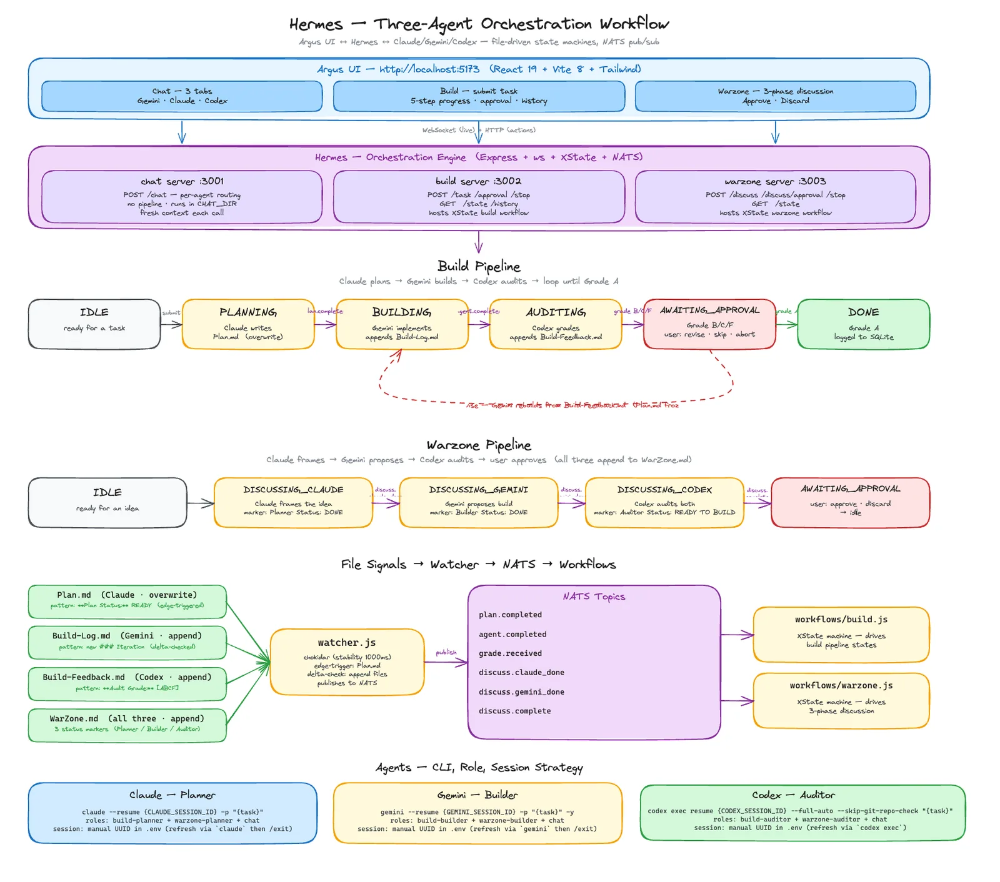

# Argus

**Argus** is a three-agent orchestration platform for software engineering. It coordinates **Claude** (planner), **Gemini** (builder), and **Codex** (auditor) through structured state machines with real-time visibility. The engine that drives it is called **Hermes**.

The goal: turn raw LLM outputs into production-ready code by enforcing a planning step, a building step, and an independent audit — with a human review loop when the audit isn't clean.



---

## Why Argus

Each LLM is strong at something different. Rather than pick one and live with its weaknesses, Argus runs a pipeline where each agent does what it's best at:

- **Claude plans** — turns a task into a concrete `Plan.md` (files to touch, approach, gotchas, verification).
- **Gemini builds** — implements the plan across the workspace, logging each iteration to `Build-Log.md`.
- **Codex audits** — reviews the implementation against the plan, grades it A / B / C / F in `Build-Feedback.md`, and lists specific revision instructions on anything less than A.

On a non-A grade, you approve in the UI and Gemini revises from the same plan using Codex's feedback. Plans are frozen across iterations — revisions are implementation fixes, not plan rewrites. When Codex gives an A, the task is done.

---

## Quick Start

### Prerequisites

- **Node.js ≥ 20** — `node --version`
- **`nats-server`** in PATH — `brew install nats-server` on macOS
- **Three agent CLIs**, each installed and authenticated with your own subscription:
  - `claude` — [Claude Code](https://docs.claude.com/claude-code)
  - `gemini` — [Gemini CLI](https://github.com/google-gemini/gemini-cli)
  - `codex` — [Codex CLI](https://github.com/openai/codex)

Argus never bundles or proxies the agents. You use your own accounts.

### Install

```bash
git clone <your-fork-url> argus
cd argus
npm install
```

A single `npm install` at the root installs all dependencies. Argus uses npm workspaces — `hermes` and `argus-ui` are workspaces of the root package, and dependencies are hoisted into a single `node_modules/`.

### Configure `hermes/.env`

Copy the template and fill in the three session UUIDs (see below):

```bash
cp hermes/.env.example hermes/.env
```

Minimum required fields:

```env
WORK_DIR=/absolute/path/to/your/argus/clone
CLAUDE_SESSION_ID=<uuid>
GEMINI_SESSION_ID=<uuid>
CODEX_SESSION_ID=<uuid>
```

### Seeding the three session UUIDs

All three agents are always invoked with `--resume <UUID>`. Hermes **never creates a session on its own** — you seed each UUID manually. This means sessions persist across restarts, across task boundaries, and can be rotated explicitly when you want a fresh context.

| Agent | How to seed |
|---|---|
| **Claude** | `cd $WORK_DIR && claude` → send one message → `/exit` → copy the UUID from the "resume this session" hint. Paste as `CLAUDE_SESSION_ID`. |
| **Gemini** | `cd $WORK_DIR && gemini` → send one message → `/exit` → the last stdout line prints `To resume this session: gemini --resume <UUID>`. Paste the UUID as `GEMINI_SESSION_ID`. |
| **Codex** | `cd $WORK_DIR && codex exec --full-auto --skip-git-repo-check "hello"` → the UUID is printed in the stdout header as `session id: <UUID>`. Paste as `CODEX_SESSION_ID`. |

To **rotate** any session later, re-run the same procedure and paste the new UUID, then restart Hermes.

### Run

```bash
# From the repo root
nats-server &                  # or: brew services start nats-server
npm run dev
```

`npm run dev` uses `concurrently` to start all four processes in one terminal:

| Process | Port | Purpose |
|---|---|---|
| `chat` | 3001 | Direct per-agent chat |
| `build` | 3002 | Three-agent build pipeline |
| `warzone` | 3003 | Three-phase pre-build discussion |
| `ui` | 5173 | Argus React UI (Vite dev server) |

Open **http://localhost:5173**.

---

## Repository Layout

```
argus/
├── Images/
│   └── architecture.webp     Diagram used in this README
│
├── argus-ui/                  React 19 + Vite + TailwindCSS 4
│   ├── src/
│   │   ├── components/        Build / Warzone / Chat / Logs views
│   │   ├── hooks/             WebSocket hooks per server
│   │   └── ...
│   └── README.md              UI-specific docs
│
├── hermes/                    Node.js orchestration engine
│   ├── core/                  NATS, agents, SQLite, file watcher
│   ├── workflows/             XState machines (build, warzone)
│   ├── servers/               Express + WebSocket servers (chat/build/warzone)
│   ├── .env.example           Template — copy to hermes/.env and seed UUIDs
│   └── HERMES.md              Engine reference
│
├── .claude/CLAUDE.md          Planner role specification
├── .gemini/GEMINI.md          Builder role specification
├── .codex/CODEX.md            Auditor role specification
│
├── package.json               Root — workspaces + dev script
├── README.md                  This file
└── workflow.md                End-to-end pipeline walkthrough
```

> **Note:** the `landing/` folder (Argus marketing site) lives in a **separate repository** and is git-ignored here.

### Runtime files (never committed)

During a build, Hermes and the agents generate four files at `WORK_DIR`:

| File | Owner | Purpose |
|---|---|---|
| `Plan.md` | Claude | Plan for the current task — **overwritten per task** |
| `Build-Log.md` | Gemini | Iteration log — **append-only** |
| `Build-Feedback.md` | Codex | Audit reports with grades — **append-only** |
| `WarZone.md` | All three | Three-phase discussion log — **append-only** |

These are git-ignored. They regenerate on every run and contain run-specific content.

---

## Architecture Overview

```
┌─────────────────────────────────────────────────────────────┐
│                    Argus UI (port 5173)                     │
│            React 19 · Vite 8 · TailwindCSS 4                │
└────────────┬────────────────────────────────────────────────┘
             │ WebSocket + HTTP
┌────────────┴────────────────────────────────────────────────┐
│                   Hermes Engine (Node.js 20)                │
│  ┌──────────────┐  ┌──────────────┐  ┌──────────────────┐   │
│  │ chat :3001   │  │ build :3002  │  │ warzone :3003    │   │
│  └──────┬───────┘  └──────┬───────┘  └────────┬─────────┘   │
│         │                 │                   │             │
│  ┌──────┴─────────────────┴───────────────────┴─────────┐   │
│  │  XState v5 · NATS pub/sub · SQLite · chokidar        │   │
│  └──────────────────────┬───────────────────────────────┘   │
└─────────────────────────┼───────────────────────────────────┘
                          │ spawn: `<cli> --resume <UUID> ...`
     ┌────────────────────┼────────────────────┐
     │                    │                    │
┌────┴─────┐        ┌─────┴─────┐        ┌─────┴────┐
│  Claude  │        │  Gemini   │        │  Codex   │
│ Planner  │        │  Builder  │        │ Auditor  │
└──────────┘        └───────────┘        └──────────┘
```

See the full diagram at the top of this README, and [workflow.md](workflow.md) for the state machines in detail.

---

## Three-Agent Pipeline

### Build flow

```
idle → planning → building → auditing → awaiting_approval → (loop | done)
      (Claude)   (Gemini)   (Codex)
```

| Stage | Agent | Output |
|---|---|---|
| `planning` | Claude | `Plan.md` (overwritten per task) |
| `building` | Gemini | `Build-Log.md` (append-only, one entry per iteration) |
| `auditing` | Codex | `Build-Feedback.md` (grade A/B/C/F per audit) |

On **grade A** the task is marked done. On **B/C/F** the user approves in the UI and Gemini rebuilds from the same `Plan.md` using Codex's feedback. Retry depth is capped — on repeated failure the pipeline pauses for human review.

### Warzone flow (pre-build discussion)

```
idle → discussing_claude → discussing_gemini → discussing_codex → awaiting_approval
```

All three agents append to `WarZone.md` in order: Claude frames the idea, Gemini proposes a build approach, Codex audits both takes. When done, the UI renders each agent's contribution as pretty-printed markdown for human review. After approval, reference `WarZone.md` in a real Build task.

### Chat

Three tabs: Gemini, Claude, Codex. Each speaks to its own persistent session. No pipeline, no file logging — direct conversation.

---

## File Signals

Hermes uses file writes as state-transition signals. A chokidar watcher publishes NATS events when specific patterns appear.

| File | Owner | Signal pattern | NATS event |
|---|---|---|---|
| `Plan.md` | Claude | `**Plan Status:** READY` | `plan.completed` |
| `Build-Log.md` | Gemini | new `### Iteration N` entry | `agent.completed` |
| `Build-Feedback.md` | Codex | `**Audit Grade:** [ABCF]` | `grade.received` |
| `WarZone.md` | All three | `**Planner Status:** DONE` → `**Builder Status:** DONE` → `**Auditor Status:** READY TO BUILD` | `discuss.claude_done` → `discuss.gemini_done` → `discuss.complete` |

`Plan.md` is deleted by `submitTask` before each new build, so every plan write is unambiguously a new plan. The others are append-only and the watcher compares content deltas.

---

## Safety Model

- Agents are scoped to `WORK_DIR` and run with standard user permissions.
- Each role doc (`.claude/CLAUDE.md`, `.gemini/GEMINI.md`, `.codex/CODEX.md`) restricts file ownership — Gemini cannot write to `Plan.md`, Codex cannot write to `Build-Log.md`, etc.
- `hermes/` is off-limits to all agents — only the human edits the engine.
- Retry depth is capped (1 retry per state transition) to prevent runaway loops. On repeated failure the pipeline transitions to `paused` for human review.
- Every NATS event is persisted to `hermes/hermes.db` for post-hoc debugging.

---

## Troubleshooting

| Symptom | Fix |
|---|---|
| `ECONNREFUSED` on startup | Start `nats-server &` before `npm run dev`. |
| Claude session expired / `exit code 1` | Re-seed `CLAUDE_SESSION_ID` in `hermes/.env`, restart Hermes. |
| Gemini session expired | Re-seed `GEMINI_SESSION_ID`, restart Hermes. |
| Codex session expired | Re-seed `CODEX_SESSION_ID`, restart Hermes. |
| Stuck in `planning` | Claude did not write `**Plan Status:** READY` to `Plan.md`. Check the `[build]` stdout. |
| Stuck in `building` | Gemini did not append a new `### Iteration` to `Build-Log.md`. |
| Stuck in `auditing` | Codex did not write `**Audit Grade:** [ABCF]` to `Build-Feedback.md`. |
| Warzone stuck mid-phase | Check `WarZone.md` for the expected status marker at the current phase. |
| Edits to `hermes/core/agents.json` don't take effect | Restart Hermes — agents.json is loaded once on startup and cached in memory. |

---

## Docs

- **[workflow.md](workflow.md)** — full end-to-end pipeline walkthrough, state tables, file signal table, troubleshooting matrix
- **[hermes/HERMES.md](hermes/HERMES.md)** — engine reference (folder structure, `.env` fields, agents.json config, Codex CLI quirks, session management matrix)
- **[argus-ui/README.md](argus-ui/README.md)** — UI stack, scripts, section map, extension guide
- **[.claude/CLAUDE.md](.claude/CLAUDE.md)** / **[.gemini/GEMINI.md](.gemini/GEMINI.md)** / **[.codex/CODEX.md](.codex/CODEX.md)** — role specifications each agent is prompted with

---

## License

Proprietary — Karinga.dev. All rights reserved.
