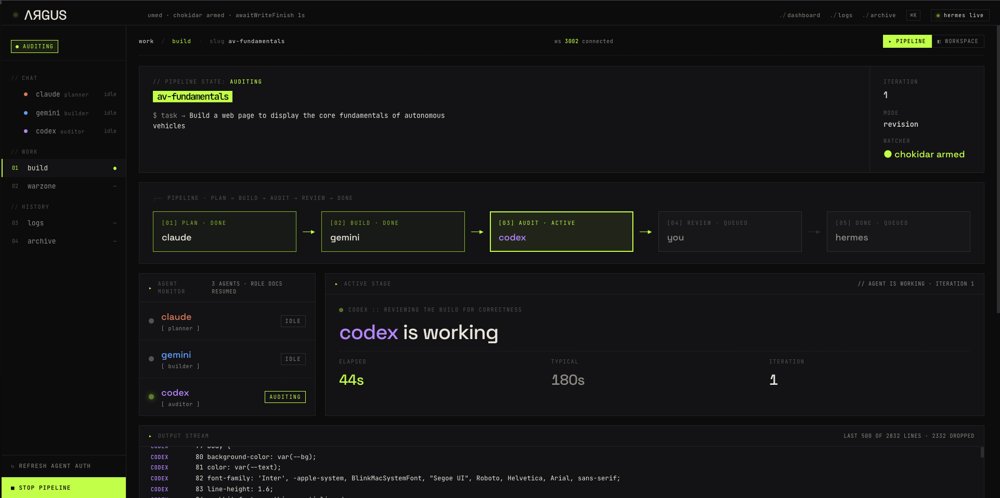
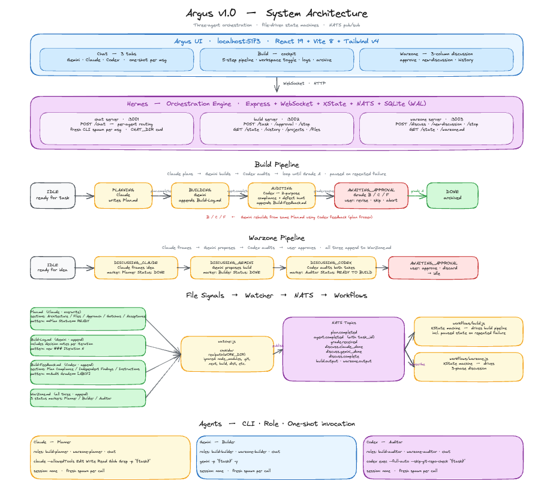

# Argus

[](CHANGELOG.md)



**Argus** is a three-agent orchestration platform for software engineering. It coordinates **Claude** (planner), **Gemini** (builder), and **Codex** (auditor) through structured state machines with real-time visibility. The engine that drives it is called **Hermes**.

The goal: turn raw LLM outputs into production-ready code by enforcing a planning step, a building step, and an independent audit — with a human review loop when the audit isn't clean.



> **Requires your own Claude / Gemini / Codex CLI accounts.** Argus spawns each CLI in one-shot mode using your local authentication — it never bundles, proxies, or stores vendor credentials.

> **→ Ready to install? See [SETUP.md](SETUP.md).**

---

## Why Argus

Each LLM is strong at something different. Rather than pick one and live with its weaknesses, Argus runs a pipeline where each agent does what it's best at:

- **Claude plans** — picks a kebab-case slug for the task (e.g. `landing-page`) and turns the task into a concrete `<slug>-Plan.md` with **architecture** (stack + directory structure + cross-cutting concerns), files to touch, approach, gotchas, and **acceptance criteria** (independently verifiable assertions that define "done").
- **Gemini builds** — implements the plan across the workspace, logging each iteration to `<slug>-Build-Log.md` with decision notes for any judgment calls or plan deviations.
- **Codex audits** — runs a two-purpose audit: **plan compliance** (does the build match the plan's architecture + acceptance criteria + files?) AND **independent defect detection** across five categories (Security / Correctness / Resource / Interaction / Maintainability). Grades A / B / C / F in `<slug>-Build-Feedback.md`, with revision instructions for anything less than A.

On a non-A grade, you approve in the UI and Gemini revises from the same plan using Codex's feedback. Plans are frozen across iterations — revisions are implementation fixes, not plan rewrites. When Codex gives an A, the task is done — and at that moment the three meta files move into `Build-History/<slug>/` so the live workspace always holds exactly one task's meta files. The `<slug>/` deliverable folder stays in place for you to continue iterating on.

---

## Features

- **Three-agent build pipeline with iteration loop.** Claude plans → Gemini builds → Codex audits → grade A/B/C/F. Non-A grades route back to Gemini with the audit feedback; the plan stays frozen across iterations.
- **Opt-in plan-review gate.** After Claude writes the plan, the pipeline pauses so you can read it. Approve to build, or send feedback that re-invokes Claude with the requested changes — before any code is written.
- **Opt-in auto-approve loop.** Continuous build → audit → revise without per-iteration clicks. Configurable cap (default 10, max 20); cap-hit pauses for human review.
- **Project continuation.** Pick an existing project from a dropdown; the agents reuse the slug and iterate on existing files in the same deliverable folder. Per-task meta files archive on completion; deliverables persist.
- **Warzone discussion mode.** Three-agent debate before a build — Claude frames the idea, Gemini proposes a build approach, Codex audits both — producing a structured `WarZone.md` you can then reference in a real Build task.
- **Live cockpit + workspace mode.** Pipeline-mode HUD with agent-color progress strip, real-time output stream, and inline stop control. Toggle to workspace mode for a filterable file browser + line-numbered preview that lets you watch files land in real time.
- **Paginated task history with drill-down.** Searchable `/logs` view (filter by status / grade); click any row to expand a task-detail panel with the iteration grade trail, per-agent durations, and files written.
- **Zero-config first run.** `git clone && npm install && npm run dev` — Argus prompts once for the project directory (defaults to a sibling `argus-workspace/` folder), creates it, and writes `.env` itself. Subsequent runs are silent.

---

## Architecture Overview

```
┌─────────────────────────────────────────────────────────────┐
│                    Argus UI (port 5173)                     │
│            React 19 · Vite 8 · TailwindCSS 4                │
└────────────┬────────────────────────────────────────────────┘
             │ WebSocket + HTTP
┌────────────┴────────────────────────────────────────────────┐
│                   Hermes Engine (Node.js 20)                │
│  ┌──────────────┐  ┌──────────────┐  ┌──────────────────┐   │
│  │ chat :3001   │  │ build :3002  │  │ warzone :3003    │   │
│  └──────┬───────┘  └──────┬───────┘  └────────┬─────────┘   │
│         │                 │                   │             │
│  ┌──────┴─────────────────┴───────────────────┴─────────┐   │
│  │  XState v5 · NATS pub/sub · SQLite · chokidar        │   │
│  └──────────────────────┬───────────────────────────────┘   │
└─────────────────────────┼───────────────────────────────────┘
                          │ spawn: `<cli> -p "<task>" ...` (one-shot)
     ┌────────────────────┼────────────────────┐
     │                    │                    │
┌────┴─────┐        ┌─────┴─────┐        ┌─────┴────┐
│  Claude  │        │  Gemini   │        │  Codex   │
│ Planner  │        │  Builder  │        │ Auditor  │
└──────────┘        └───────────┘        └──────────┘
```

See the full diagram at the top of this README, and [workflow.md](workflow.md) for the state machines in detail.

---

## Repository Layout

```
argus/
├── Images/
│   ├── Argus-V1.png               Hero image (README)
│   ├── Full-Architecture.png      Full system diagram (README)
│   └── Pipeline-Architecture.png  Pipeline + file-signals walkthrough (workflow.md)
│
├── argus-ui/                  React 19 + Vite + TailwindCSS 4
│   ├── src/
│   │   ├── components/        Build / Warzone / Chat / Logs / Archive views
│   │   ├── hooks/             WebSocket hooks per server
│   │   └── ...
│   └── README.md              UI-specific docs
│
├── hermes/                    Node.js orchestration engine
│   ├── core/                  NATS, agents, SQLite, file watcher, role-doc bootstrap
│   ├── workflows/             XState machines (build, warzone)
│   ├── servers/               Express + WebSocket servers (chat/build/warzone)
│   ├── .env.example           Template — used by first-run bootstrap to seed hermes/.env
│   └── HERMES.md              Engine reference
│
├── .claude/CLAUDE.md          Planner role specification
├── .gemini/GEMINI.md          Builder role specification
├── .codex/CODEX.md            Auditor role specification
│
├── package.json               Root — workspaces + dev script
├── README.md                  This file
├── SETUP.md                   Install & run guide
└── workflow.md                End-to-end pipeline walkthrough
```

---

## Three-Agent Pipeline

### Build flow

```
idle → planning → [awaiting_plan_review] → building → auditing → awaiting_approval → (loop | done)
      (Claude)         (opt-in)            (Gemini)   (Codex)
```

| Stage | Agent | Output |
|---|---|---|
| `planning` | Claude | `<slug>-Plan.md` (slug chosen by Claude on a new project, or fixed by the UI on a continuation) |
| `awaiting_plan_review` | — | opt-in (`planReview: true` on submit) — user reviews the plan and either approves or sends feedback that re-invokes Claude with the requested changes |
| `building` | Gemini | `<slug>-Build-Log.md` (append-only within the task) + deliverables under `<slug>/` |
| `auditing` | Codex | `<slug>-Build-Feedback.md` (grade A/B/C/F per audit) |

On **grade A** the task is marked done. On **B/C/F** Gemini rebuilds from the same `<slug>-Plan.md` using Codex's feedback — either after a human "Revise" click in the UI, or **automatically when auto-approve is enabled** (`autoApprove: true` on submit, default cap 10 iterations, max 20). Hitting the cap or repeated agent failure pauses the pipeline for human review. As soon as the task completes (grade A, skip, or abort), the three meta files move into `Build-History/<slug>/{Plan.md, Build-Log.md, Build-Feedback.md}` (slug prefix dropped). The `<slug>/` deliverable folder stays in place — re-select it from the Build tab's "Project" dropdown to continue iterating on the same project.

### Warzone flow (pre-build discussion)

```
idle → discussing_claude → discussing_gemini → discussing_codex → awaiting_approval
```

All three agents append to `<slug>-WarZone.md` in order — Claude picks the slug on the first round, then frames the idea; Gemini proposes a build approach; Codex audits both takes. When done, the UI renders each agent's contribution as pretty-printed markdown for human review. After approval, submit again to add another round on the same topic. Click **New Discussion** in the Warzone header to archive the file into `WarZone-History/<slug>/WarZone.md` and start a fresh topic.

### Chat

Three tabs: Gemini, Claude, Codex. Each message is a fresh one-shot CLI invocation — no pipeline, no file logging, no session state. The UI keeps the transcript so the conversation still reads as continuous.

---

## File Signals

Hermes uses file writes as state-transition signals. A chokidar watcher publishes NATS events when specific patterns appear.

| File | Owner | Signal pattern | NATS event |
|---|---|---|---|
| `<slug>-Plan.md` | Claude | `**Plan Status:** READY` | `plan.completed` |
| `<slug>-Build-Log.md` | Gemini | new `### Iteration N` entry | `agent.completed` |
| `<slug>-Build-Feedback.md` | Codex | `**Audit Grade:** [ABCF]` | `grade.received` |
| `<slug>/` | Gemini | (not watched) | — deliverable folder per project |
| `<slug>-WarZone.md` | All three | `**Planner Status:** DONE` → `**Builder Status:** DONE` → `**Auditor Status:** READY TO BUILD` | `discuss.claude_done` → `discuss.gemini_done` → `discuss.complete` |

The watcher uses globs (`*-Plan.md`, `*-Build-Log.md`, `*-Build-Feedback.md`) at the project root — deliverable subfolders, `Build-History/`, and `WarZone-History/` are not watched. Each task's three meta files move into `Build-History/<slug>/` the moment the task completes (or is aborted); `submitTask` re-runs the same archival as a safety net to catch any stale files left behind by a crash. Deliverables stay in their `<slug>/` folder; the user can iterate on them by selecting **Continue: \<slug\>** in the Build tab.

---

## Safety Model

- Agents are scoped to `WORK_DIR` and run with standard user permissions.
- Each role doc (`.claude/CLAUDE.md`, `.gemini/GEMINI.md`, `.codex/CODEX.md`) restricts file ownership — Gemini cannot write to `Plan.md`, Codex cannot write to `Build-Log.md`, etc.
- `hermes/`, `argus-ui/`, and any directory outside `WORK_DIR` are off-limits to all agents — only the human edits the engine and dashboard.
- Retry depth is capped (1 retry per state transition) to prevent runaway loops. On repeated failure the pipeline transitions to `paused` for human review.
- Every NATS event is persisted to `hermes/hermes.db` for post-hoc debugging.

---

## Docs

- **[CHANGELOG.md](CHANGELOG.md)** — version history
- **[SETUP.md](SETUP.md)** — install, configure, run, troubleshoot
- **[workflow.md](workflow.md)** — full end-to-end pipeline walkthrough, state tables, file signal table
- **[hermes/HERMES.md](hermes/HERMES.md)** — engine reference (folder structure, `.env` fields, `agents.json` config, Codex CLI quirks)
- **[argus-ui/README.md](argus-ui/README.md)** — UI stack, scripts, section map, extension guide
- **[.claude/CLAUDE.md](.claude/CLAUDE.md)** / **[.gemini/GEMINI.md](.gemini/GEMINI.md)** / **[.codex/CODEX.md](.codex/CODEX.md)** — role specifications each agent is prompted with

---

## Author

Built by **[Nagesh Goud Karinga](https://github.com/Nkaringa)** 


